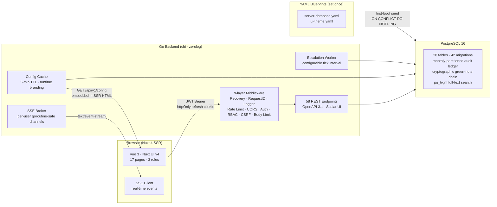

<div align="center">
  
</div>

<div align="center">
  <br/>
  <em>Document governance infrastructure for organizations that cannot afford ambiguity.</em>
  <br/><br/>

  [](https://go.dev)
  [](https://nuxt.com)
  [](https://www.postgresql.org)
  [](./LICENSE)
  [](./docs/architecture/architecture-api-routes.md)
  [](./docker-compose.yml)
  [](./docs/guides/it-customization-guide.md)

  <br/>

  <table>
    <tr>
      <td align="center"><strong>17</strong><br/><sub>UI pages</sub></td>
      <td align="center"><strong>3</strong><br/><sub>user roles</sub></td>
      <td align="center"><strong>58</strong><br/><sub>API endpoints</sub></td>
      <td align="center"><strong>42</strong><br/><sub>DB migrations</sub></td>
      <td align="center"><strong>3</strong><br/><sub>domain pillars</sub></td>
      <td align="center"><strong>&lt; 200 ms</strong><br/><sub>p99 latency target</sub></td>
    </tr>
  </table>
</div>

---

> [!NOTE]
> Go 1.26 · chi router · zerolog · cobra CLI. PostgreSQL 16 with monthly range-partitioned audit ledger, SHA-256 cryptographic green-note chain, pg_trgm full-text search, and 42 migration files rendered via Go `text/template` for configurable schema aliases. Nuxt 4 SSR with zero client-side config round-trips — runtime branding and nav tree are embedded in the initial HTML payload from a 5-minute in-memory config cache. 9-layer middleware stack: Recovery → RequestID → Logger → Rate Limit → CORS → Auth → RBAC → CSRF → Body Limit. Self-hosted only. No external services required at runtime.

---

## Architecture



---

## Three Pillars

| Pillar | Mechanism | Key table |
|---|---|---|
| **DAK Diarization** | Rule-engine routes dispatch by `(doc_type × sender × urgency)`. Escalation worker fires on configurable deadline threshold. | `dispatches`, `dispatch_events`, `routing_rules` |
| **Green Noting Canvas** | Minute sheets with append-only notes. Each note: `SHA-256(content ‖ seq ‖ author_id ‖ previous_hash)`. Role-gated `workflow.approve` permission for countersigning. | `minute_sheets`, `green_notes` |
| **RBAC Audit Ledger** | `bigserial` PK (not UUID) for partition-efficient access. `previous_checksum` chains entire ledger. `GET /api/v1/audit-log/verify` re-computes on demand and returns the first broken row ID. | `audit_ledger` (monthly partitions) |

---

## Quick Start

```bash
# 1. Clone and configure
git clone https://github.com/your-org/aethel-workspace.git
cd aethel-workspace
cp .env.example .env          # set AETHEL_JWT_SECRET and AETHEL_DB_PASSWORD

# 2. Start everything
make dev                      # PostgreSQL + Go backend + Nuxt frontend via Docker Compose

# 3. Apply database schema
make migrate-up               # 42 migrations, ~2 seconds on first run

# 4. Create initial sys_admin account
go run ./cmd/aethel bootstrap-admin   # prints temporary password — change immediately
```

| Service | URL | Notes |
|---|---|---|
| Frontend | http://localhost:3000 | Nuxt 4 · hot-reload in dev |
| Backend API | http://localhost:8080/api/v1 | JWT-authenticated |
| API documentation | http://localhost:8080/api/docs | Scalar UI — interactive |
| Health probe | http://localhost:8080/healthz | liveness |
| Readiness probe | http://localhost:8080/readyz | db.Ping() included |

---

## API at a Glance

| Method | Path | Description |
|---|---|---|
| `GET` | `/api/v1/config` | Runtime config (branding, nav, feature flags) — embedded in SSR HTML |
| `POST` | `/api/v1/auth/login` | Argon2id credential check; issues JWT access token + httpOnly refresh cookie |
| `POST` | `/api/v1/auth/logout` | Rotates refresh token, clears cookie |
| `GET` | `/api/v1/dispatches` | Paginated dispatch list; supports `?status=`, `?priority=`, `?q=` (pg_trgm) |
| `POST` | `/api/v1/dispatches` | Create dispatch — triggers routing rule evaluation and audit event |
| `GET` | `/api/v1/audit-ledger` | Paginated audit log (`sys_admin` only); supports time-range filters |

Full OpenAPI 3.1 spec with all 58 operationIds at [`docs/architecture/architecture-api-routes.md`](./docs/architecture/architecture-api-routes.md). Interactive Scalar UI available at `http://localhost:8080/api/docs` when the backend is running.

---

## Tech Stack

<table>
  <tr>
    <td><strong>Frontend</strong></td>
    <td>
      
      
      
      
      
    </td>
  </tr>
  <tr>
    <td><strong>Backend</strong></td>
    <td>
      
      
      
      
    </td>
  </tr>
  <tr>
    <td><strong>Database</strong></td>
    <td>
      
      
      
      
    </td>
  </tr>
  <tr>
    <td><strong>Auth</strong></td>
    <td>
      
      
      
      
    </td>
  </tr>
  <tr>
    <td><strong>Infrastructure</strong></td>
    <td>
      
      
      
    </td>
  </tr>
  <tr>
    <td><strong>Testing</strong></td>
    <td>
      
      
      
    </td>
  </tr>
</table>

---

## Feature Reference

<details>
<summary><strong>DAK Diarization — Dispatch Tracking (expanded)</strong></summary>
<br/>

**Routing rule engine** — Rules are evaluated in priority order at dispatch creation. Each rule matches on any combination of: document type, sender organization, urgency level (`ROUTINE` / `PRIORITY` / `IMMEDIATE`). The first matching rule assigns the dispatch to the configured department. If no rule matches, the dispatch enters the unassigned inbox for manual routing.

**Dispatch lifecycle**

```
PENDING_ASSIGNMENT → UNDER_REVIEW → IN_TRANSIT → DELIVERED
                                               ↘ ESCALATED (worker fires)
                                               ↘ REJECTED
```

**Timeline events** — A unified `dispatch_events` table aggregates all routing decisions, handoffs, escalations, and status changes. The document detail page renders this as a live timeline without multi-table UNIONs.

**Escalation worker** — A background goroutine evaluates all dispatches older than the configured threshold. When a dispatch exceeds its deadline, its status transitions to `ESCALATED`, a notification is sent to the assigned department head, and an audit event is written. The evaluation interval is blueprint-configurable.

**Config cache** — Runtime-configurable branding (colors, fonts, logo), navigation structure, and feature flags are stored in PostgreSQL and served via `GET /api/v1/config` with a 5-minute in-memory TTL. The response is embedded in the initial SSR HTML — zero client-side config round-trips.

</details>

<details>
<summary><strong>Green Noting Canvas — Minute Sheets</strong></summary>
<br/>

Every dispatch automatically gets a minute sheet on creation. The minute sheet is the official record of institutional action taken on that document.

**Hash chain integrity**

Each green note is inserted with:
```
cryptographic_hash = SHA-256(content ‖ sequence_number ‖ author_id ‖ previous_hash)
```

The database stores both the note's own hash and the `previous_hash` of its predecessor. Any attempt to alter a note's content, swap two notes, or delete a note from the middle of the chain produces a hash mismatch detectable at the next verification pass.

**Approval countersigning** — Notes flagged as approvals require a role with `workflow.approve` permission. The approval is recorded with the signer's user ID and timestamp. Attempted approvals by under-privileged users are rejected with `403` and logged to the audit ledger.

</details>

<details>
<summary><strong>RBAC Audit Ledger — Tamper Detection</strong></summary>
<br/>

**Schema design choices:**
- `bigserial` primary key (not UUID) for partition-efficient sequential access
- `organization_id` stored as plain `uuid` without FK — audit records survive organization deletion
- `previous_checksum` chains rows: each new entry hashes `(event_type ‖ actor_id ‖ resource_id ‖ created_at ‖ previous_checksum)`
- Monthly `PARTITION BY RANGE(created_at)` — old partitions can be archived or moved to cold storage without touching the active partition

**Verification endpoint** — `GET /api/v1/audit-log/verify?from=&to=` (requires `sys_admin` role) re-fetches every row in the range and recomputes the checksum chain from scratch. Response:

```json
{
  "verified": false,
  "rows_checked": 4821,
  "first_broken_at": {
    "row_id": 1337,
    "created_at": "2026-05-14T09:23:11Z",
    "expected_checksum": "a3f9...",
    "actual_checksum": "b7c2..."
  }
}
```

**Tamper event types** — The ledger captures: `DISPATCH_CREATED`, `DISPATCH_ASSIGNED`, `DISPATCH_DELIVERED`, `GREEN_NOTE_APPENDED`, `PERMISSION_DENIED`, `SECURITY_BREACH_ATTEMPT`, `UNAUTHORIZED_ACCESS_BYPASSED`, `RBAC_ELEVATION_ATTEMPT`.

</details>

---

## Configuration

<details>
<summary><strong>Environment variables</strong></summary>
<br/>

| Variable | Required | Default | Description |
|---|---|---|---|
| `AETHEL_JWT_SECRET` | **Yes (prod)** | — | HS256 signing secret — min 32 bytes, base64-encoded. Server refuses to start if unset in production. |
| `AETHEL_DB_PASSWORD` | **Yes** | — | PostgreSQL password |
| `AETHEL_ENV` | No | `development` | `development` or `production` |
| `AETHEL_PORT` | No | `8080` | HTTP listen port |
| `AETHEL_DB_DSN` | No | — | Full DSN; overrides individual DB fields if set |

See `.env.example` for the complete reference with commentary.

</details>

<details>
<summary><strong>Blueprint files (IT-facing)</strong></summary>
<br/>

Only two YAML files require IT attention at deployment. Everything else is runtime-configurable through the admin panel.

| File | Purpose |
|---|---|
| `blueprints/server-database.yaml` | DB connection, pool sizing, schema aliases, auth cost params, server port, rate limit RPM |
| `blueprints/ui-theme.yaml` | Initial branding seed — primary color, neutral palette, font, wordmark, logo path. Loaded once at first boot; subsequent changes go through `/admin/branding`. |

The blueprint JSON Schema is at `blueprints/schemas/server-database.schema.json` — wire it to your editor for validation and autocomplete.

</details>

---

## Command Reference

<details>
<summary><strong>All make targets</strong></summary>
<br/>

**Development**
```bash
make dev           # Start PostgreSQL + backend + frontend (Docker Compose)
make dev-fe        # Nuxt dev server only — hot reload at :3000
make dev-be        # Go backend with Air live reload at :8080
make dev-db        # PostgreSQL container only
make dev-down      # Stop all containers (volumes preserved)
make dev-reset     # Full reset — wipe volumes, fresh database
```

**Testing**
```bash
make test          # All tests: frontend unit + backend unit + race detector
make test-fe       # Vitest unit + Nuxt component tests
make test-be       # go test ./... -race -short
make test-e2e      # Playwright E2E against running dev stack
```

**Database**
```bash
make migrate-up          # Apply all pending migrations
make migrate-down        # Roll back the last migration
make migrate-status      # Show applied / pending
make migrate-validate    # Render templates + SQL syntax check (no writes)
make db-shell            # Open psql into the dev database
make db-dump             # Dump to /tmp/aethel-dump-<timestamp>.sql
```

**Build**
```bash
make build          # Build frontend + backend binaries
make build-docker   # Build both Docker images locally
```

</details>

---

## Documentation

| Document | Description |
|---|---|
| [Architecture overview](./docs/architecture/) | Code architecture, server design, API routes, security model |
| [ER diagram](./docs/db-design.mmd) | Full database entity-relationship diagram (Mermaid) |
| [API routes](./docs/architecture/architecture-api-routes.md) | All 58 operationIds with request/response schemas |
| [Security architecture](./docs/architecture/architecture-security.md) | Auth model, middleware stack, threat model |
| [Go developer guide](./docs/guides/go-developer-guide.md) | Conventions, repo pattern, adding endpoints |
| [DevOps tooling](./docs/devops/devops-tooling.md) | Docker, Kubernetes, GitHub Actions CI/CD reference |

---

## License

Apache 2.0 — see [`LICENSE`](./LICENSE). Contributions welcome — see [`CONTRIBUTING.md`](./CONTRIBUTING.md).

<br/>

---

<div align="center">
  <sub><a href="./SECURITY.md">Security Policy</a> · <a href="./CONTRIBUTING.md">Contributing</a></sub>
</div>
